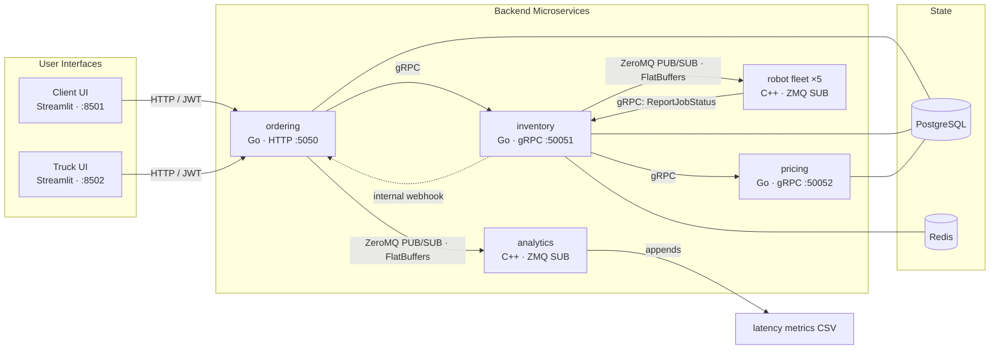

# 🛒 Auto Grocery — Distributed Smart-Store Platform

A distributed, event-driven backend that runs an **automated grocery store**: customers place orders and suppliers restock shelves, and both flows are fulfilled by a **fleet of aisle-scoped warehouse robots**. Five microservices coordinate over **gRPC, ZeroMQ, and HTTP webhooks**, with **FlatBuffers** on the wire, backed by **PostgreSQL** and **Redis**, and driven by two **Streamlit** dashboards — the whole stack boots with a single `docker compose up`.

<p>
  
  
  
  
  
  
  
  
  
</p>

---

## What it does

Auto Grocery models a small automated warehouse:

- **Customers** (Client UI) authenticate, build a cart, scan live stock availability, and dispatch robots to pick their order. They watch the order move `PENDING → PROCESSING → COMPLETED` in real time and get an itemized receipt.
- **Suppliers** (Truck UI) submit a restock manifest; robots offload the truck, inventory is upserted, and prices are re-computed from the new stock levels.
- **Robots** are independent workers, one per aisle (`bread`, `meat`, `produce`, `dairy`, `party`). Each subscribes to a task bus, picks only the items in its aisle, and reports completion back.
- **Analytics** passively records per-order completion latency to a metrics log.

The interesting part is the coordination: a single order fans out to a robot fleet over a message bus, results are aggregated, billing runs exactly once (guarded against duplicates), and the customer-facing status updates flow back through internal webhooks — all decoupled, all asynchronous.

---

## Architecture



The system deliberately uses **four** communication mechanisms, each where it fits best:

| Mechanism | Used for |
| --- | --- |
| **gRPC** (Protobuf) | Typed request/response between services (`ordering→inventory`, `inventory→pricing`, robot callbacks) |
| **ZeroMQ PUB/SUB** | One-to-many fan-out of robot tasks and analytics events |
| **FlatBuffers** | Zero-copy message wire format carried over ZeroMQ |
| **HTTP** | Public JWT-authenticated API + secret-protected internal webhooks |

---

## Services at a glance

| Service | Language | Role | Exposes |
| --- | --- | --- | --- |
| **ordering** | Go | User-facing API gateway / orchestrator for both order flows; JWT auth; webhook receiver; analytics publisher | HTTP `:5050` |
| **inventory** | Go | Execution backbone: atomic stock reserve/release, robot dispatch, progress aggregation, one-time finalization | gRPC `:50051`, ZMQ PUB `:5556` |
| **pricing** | Go | SKU price catalog, bill calculation, dynamic margin pricing from stock metrics | gRPC `:50052` |
| **robots** | C++ | Aisle-scoped worker processes (×5); pick/offload simulation; status callbacks | ZMQ SUB → gRPC client |
| **analytics** | C++ | Passive subscriber; appends order-latency rows to CSV | ZMQ SUB → CSV |
| **frontend/client** | Python · Streamlit | Customer "Smart Cart" dashboard | UI `:8501` |
| **frontend/truck** | Python · Streamlit | Supplier "Truck Offload Terminal" | UI `:8502` |

Stateful infrastructure: **PostgreSQL** (three service-owned databases — `db_ordering`, `db_inventory`, `db_pricing`) and **Redis** (ephemeral in-flight order state, progress counters, and a `SETNX` finalization guard).

---

## End-to-end flows

### Customer order
1. Client authenticates with `ordering` (`register` / `login` / `refresh`, JWT).
2. **Preview** reserves stock through `inventory.ReserveItems` (atomic, all-or-nothing); the order is persisted as `PENDING`.
3. **Confirm** triggers `inventory.ProcessCustomerOrder`, which publishes per-item robot tasks over ZeroMQ (`order_type = CUSTOMER`).
4. Aisle robots pick matching items and call back `inventory.ReportJobStatus`.
5. On completion, `inventory` **finalizes exactly once** (Redis `SETNX` guard): computes the bill via `pricing.CalculateBill` and webhooks `ordering` with the final total.
6. `ordering` updates the DB and publishes a latency metric to `analytics`. Status reaches `COMPLETED`.

### Truck restock
1. Truck UI submits a manifest; `ordering` saves the restock order and calls `inventory.RestockItemsOrder`.
2. `inventory` publishes robot tasks (`order_type = RESTOCK`); robots offload and report back.
3. On completion, `inventory` upserts `available_stock`, calls `pricing.UpdateStockMetrics` (dynamic margin: base `1.20×`, `+0.15` when stock is scarce (1–4), `−0.10` when overstocked (>100)), and webhooks `ordering` with the total cost.

---

## Tech stack & why

- **Go** for the networked core (`ordering`, `inventory`, `pricing`) — first-class gRPC/Postgres/Redis ecosystem, cheap concurrency, fast builds.
- **C++** for `robots` and `analytics` — low-latency worker components that pair naturally with the CMake + protobuf/ZeroMQ toolchain.
- **gRPC + Protocol Buffers** — strongly typed service contracts that evolve safely.
- **ZeroMQ PUB/SUB** — lightweight, high-throughput fan-out that decouples the dispatcher from the robot fleet.
- **FlatBuffers** — compact, zero-copy message format on the bus.
- **PostgreSQL** — ACID guarantees for order and inventory correctness, one database per service.
- **Redis** — fast ephemeral workflow state and a one-time finalization guard (`SETNX`) that prevents double-billing.
- **Streamlit** — quick, live operational UIs over the HTTP API.

---

## Quick start

Requires Docker + Docker Compose. From the repo root:

```bash
docker compose up --build -d
```

This brings up the full stack — **13 containers**: PostgreSQL, Redis, `pricing`, `inventory`, `ordering`, `analytics`, five robot workers, and both Streamlit UIs.

Open:

| URL | What |
| --- | --- |
| http://localhost:8501 | **Client UI** — place customer orders |
| http://localhost:8502 | **Truck UI** — submit restock manifests |
| http://localhost:5050 | Ordering HTTP API |

Follow the action:

```bash
docker compose logs -f ordering inventory pricing analytics
docker compose logs -f robot-bread robot-meat robot-produce robot-dairy robot-party
```

Tear down (add `-v` to also wipe the database and metrics volumes):

```bash
docker compose down        # stop
docker compose down -v     # stop + reset all data
```

> Manual, per-service startup (native Go/C++ binaries) is fully documented in [`HowToInstantiateServices.txt`](HowToInstantiateServices.txt) for step-by-step debugging.

---

## Try it

1. Open the **Truck UI** at http://localhost:8502 and submit a restock manifest so the shelves have stock.
2. Open the **Client UI** at http://localhost:8501, register/login, and build a cart.
3. Hit **Scan Stock Availability** — `ordering` reserves stock through `inventory`.
4. Hit **Dispatch Robots** — watch the order move `PENDING → PROCESSING → COMPLETED` as the aisle robots report in.
5. Read the itemized receipt with the computed total; check `robot-*` logs to see each aisle pick its items.

---

## Security model

- **JWT** access tokens (short-lived) + refresh tokens, with **bcrypt**-hashed passwords.
- **Internal webhooks** (`/internal/webhook/update-order`, `/internal/webhook/update-restock`) are gated by a shared `X-Internal-Secret` header that must match between `ordering` and `inventory`.
- **Redis** is password-protected with a fail-fast startup ping.
- gRPC/ZeroMQ run on a trusted internal network by design (the services share a private Docker network).

---

## Configuration & ports

All endpoints are environment-driven; the committed `.env` files hold **local demo defaults** (no external API keys required) so the stack runs out of the box.

| Component | Address |
| --- | --- |
| Ordering HTTP API | `:5050` |
| Inventory gRPC | `:50051` |
| Pricing gRPC | `:50052` |
| Robot ZMQ bus | `tcp://*:5556` (internal) |
| Analytics ZMQ bus | `tcp://*:5557` (internal) |
| PostgreSQL | `:5432` |
| Redis | `:6379` |
| Client / Truck UI | `:8501` / `:8502` |

---

## Repository layout

```
auto_grocery/
├── ordering/      # Go — HTTP API gateway / orchestrator
├── inventory/     # Go — stock, robot dispatch, finalization
├── pricing/       # Go — catalog, billing, dynamic pricing
├── robots/        # C++ — aisle-scoped robot workers
├── analytics/     # C++ — latency metrics subscriber
├── frontend/
│   ├── client/    # Streamlit — customer Smart Cart
│   └── truck/     # Streamlit — supplier Offload Terminal
├── postgres/      # Dockerfile + init SQL (per-service schemas)
├── redis/         # Dockerfile + redis.conf
└── docker-compose.yml
```

---

## Documentation

- [`HowToInstantiateServices.txt`](HowToInstantiateServices.txt) — full setup guide (Docker + manual modes).
- Per-service deep dives: [`ordering/OrderingService_Guide.txt`](ordering/OrderingService_Guide.txt), [`inventory/InventoryService_Guide.txt`](inventory/InventoryService_Guide.txt), [`pricing/PricingService_Guide.txt`](pricing/PricingService_Guide.txt), [`robots/RobotsService_Guide.txt`](robots/RobotsService_Guide.txt), [`analytics/AnalyticsService_Guide.txt`](analytics/AnalyticsService_Guide.txt).

---

## Author

**Dhiraj Jha** — [@jhadhiraj147](https://github.com/jhadhiraj147)
